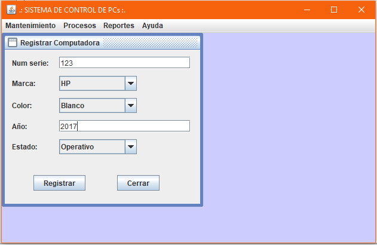

# Sistema de control de computadoras
Sistema sobre control de computadoras donde se puede registrar una computadora, en procesos buscar una computadora según su numero de serie, en los reportes tenemos el listado de todas las computadoras registradas.

<strong>Imagen:</strong> Menú principal - Registrar computadora.

